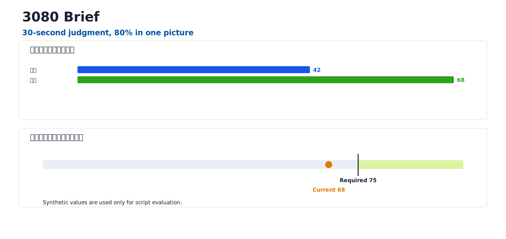

# 3080 Brief

**30-second judgment, 80% in one picture**

[](https://github.com/BobbyYue/3080-brief/actions/workflows/ci.yml)
[](LICENSE)

Source-grounded decision briefs that help readers understand the conclusion quickly and see the argument as one auditable visual.

[简体中文](README.zh-CN.md)

`3080-brief` turns a source document into a new, reader-first brief without modifying the source. Its opening has exactly three units:

1. one primary judgment sentence followed by 1–3 short evidence, action, or boundary support lines;
2. one auditable visual covering at least 80% of value-weighted, non-appendix claims;
3. one key-question table answering what readers are most likely to ask.



The example above contains synthetic evaluation data only.

## Why use it

- Source-grounded: every number, conclusion, risk, and recommendation must be traceable or labeled as an inference.
- Reader-first: reorganizes the source around what readers need to understand, trust, decide, or do.
- Format-aware: Feishu/Lark creates a new Feishu/Lark document; Word creates a new `.docx`; Markdown creates new Markdown.
- Visual by design: the opening visual is editable in Feishu and is checked against a value-weighted claim ledger.
- Reviewable: deterministic preflight, three independent review roles, and blind-reader replay are part of the release gate.
- Lean by default: normal runtime loads only `SKILL.md` (currently 11.6KB); detailed references load only when their branch is reached.

## Install

Ask Codex to install the skill from this repository at `skills/3080-brief`.

Or use the bundled Codex skill installer:

```bash
python3 "${CODEX_HOME:-$HOME/.codex}/skills/.system/skill-installer/scripts/install-skill-from-github.py" \
  --repo BobbyYue/3080-brief \
  --path skills/3080-brief
```

Restart Codex after installation so the skill is registered.

## Try it

Explicit invocation:

```text
Use $3080-brief to turn this document into a reader-first decision brief.
Keep the source unchanged and create the output in the same format.
```

Natural-language invocation:

```text
请基于这份方案新建一份读者视角总结：30 秒看懂结论，
一张图覆盖核心信息，再用一个表回答读者最关心的问题。
```

It should not trigger for source editing in place, generic summaries without the reader/visual contract, or standalone whiteboard styling.

## Requirements

Core validation is offline and uses Python 3.9+ with no third-party Python packages.

Feishu/Lark output additionally requires:

- Node.js 20+;
- `@larksuite/cli` / `lark-cli` 1.0.60+;
- `@larksuite/whiteboard-cli` exactly 0.2.11 in the isolated 3080 tool cache;
- [`beautiful-feishu-whiteboard`](https://github.com/zarazhangrui/beautiful-feishu-whiteboard) 1.1.1+;
- Feishu/Lark authentication and the required document permissions.

Missing Feishu dependencies block only the Feishu path. The skill displays the exact source, version, destination, network/file effects, and command, then asks for explicit installation approval. It does not silently install dependencies.

## Verify

Run the complete offline test suite:

```bash
bash skills/3080-brief/scripts/self_test.sh
```

Check the single-owner capability ledger and runtime context budget directly:

```bash
python3 skills/3080-brief/scripts/check_context_budget.py skills/3080-brief --json
```

Check the current Feishu dependency state without installing anything:

```bash
python3 skills/3080-brief/scripts/check_dependencies.py --mode feishu --json
```

## Repository layout

```text
skills/3080-brief/   installable Codex skill
docs/assets/         public, synthetic examples
.github/workflows/   offline CI
```

User-facing project documentation stays at the repository root; runtime instructions stay inside the installable skill.

## Privacy and limitations

- Never publish source document tokens, tenant identifiers, credentials, or real internal metrics in issues or examples.
- Feishu installation approval is separate from Feishu authentication approval.
- Independent reviewer and blind-reader claims are made only when those capabilities actually ran.
- The repository does not include with-skill/without-skill benchmark claims.

## Contributing

See [CONTRIBUTING.md](CONTRIBUTING.md). Please report security-sensitive findings through the private process in [SECURITY.md](SECURITY.md).

## License

[MIT](LICENSE)
