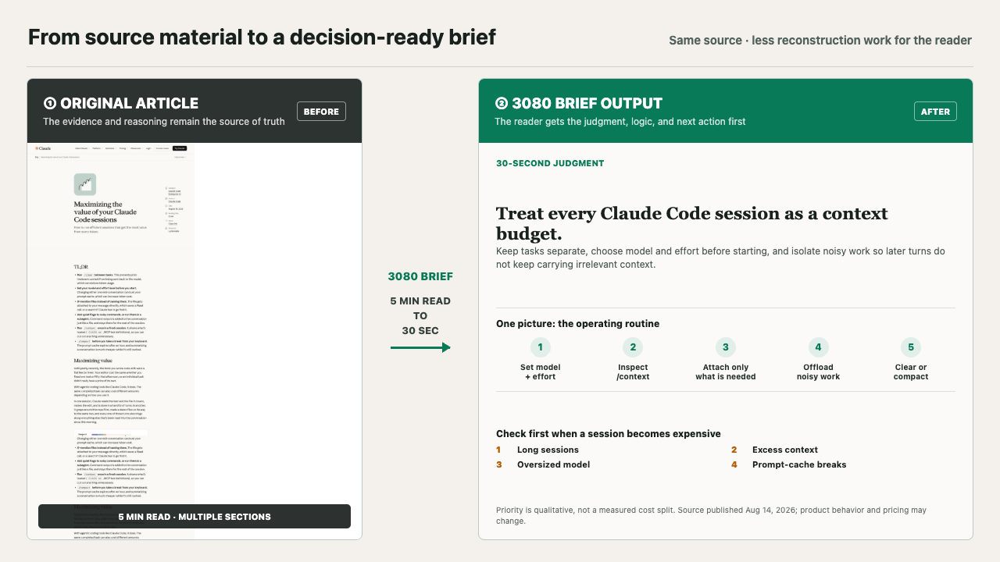

# 3080 Brief

**30-second judgment, 80% in one picture**

[](https://github.com/BobbyYue/3080-brief/actions/workflows/ci.yml)
[](LICENSE)
[](https://agentskills.io/)

[Chinese (Simplified)](README.zh-CN.md) · [Quick start](#quick-start) · [Worked example](docs/examples/claude-code-session-value.md) · [Latest release](https://github.com/BobbyYue/3080-brief/releases/latest)

An open-source **AI Agent Skill** that turns source documents into reader-first decision briefs: a 30-second executive summary, one auditable visual, a key-question table, and a clear storyline. It preserves the source and can create a new brief in Feishu/Lark, Markdown, Word/docx, or self-contained HTML when the host supports that format.

<p align="center"><strong>① Original article on the left → ② 3080 Brief output on the right</strong></p>

[](docs/examples/claude-code-session-value.md)

> **Real output example:** [Anthropic's five-minute article](https://claude.com/blog/maximizing-the-value-of-your-claude-code-sessions) explains token pricing, prompt caching, context growth, session length, and subagents across multiple sections. The 3080 Brief turns it into one operating judgment, one five-step routine, and a clear order for what to check first, while keeping the original as the source of truth. [Open the complete example →](docs/examples/claude-code-session-value.md)

## What you get

| Reader need | 3080 Brief output |
| --- | --- |
| What matters? | **One sentence** with the primary judgment and 1–3 evidence, action, or boundary lines |
| How does it fit together? | **One picture** covering at least 80% of value-weighted, non-appendix claims |
| What will readers ask next? | **One table** answering the key questions |
| What is the source really saying? | **One storyline** that reorganizes the original logic for the reader |

The source remains unchanged; the skill creates a separate brief.

## Quick start

### 1. Install the complete Skill folder

Ask any Agent Skills-compatible agent:

```text
Install the Agent Skill from https://github.com/BobbyYue/3080-brief,
using the complete subdirectory skills/3080-brief. Register it in your normal Skill directory,
then check the dependencies required for my target output and ask once before installing anything missing.
```

Or install it manually:

```bash
git clone --depth 1 https://github.com/BobbyYue/3080-brief.git
cp -R ./3080-brief/skills/3080-brief "<YOUR_AGENT_SKILLS_DIR>/3080-brief"
```

Copy the entire folder—not only `SKILL.md`—and reload the agent if its documentation requires it.

### 2. Give it a source and a concrete request

```text
Use $3080-brief to turn this document into a new reader-first decision brief.
Keep the source unchanged and create the result in the same format.
Return the generated output link or file, plus the final verification status.
```

Natural language works too:

```text
Create a new brief from this proposal: make the conclusion clear in 30 seconds,
cover the core logic in one picture, and answer the reader's key questions in one table.
```

## Why use it

- **Reader-first:** reorganizes material around what readers need to understand, trust, decide, or do.
- **Core-value extraction:** separates decision-critical conclusions, evidence, risks, and actions from background noise.
- **Clear storyline:** turns fragmented or technical source logic into a coherent argument.
- **Concrete expression:** value-bearing titles, headings, and leads state the actual object and source-supported result instead of relying on method labels or generic claims.
- **Visual reasoning:** Feishu and HTML share one explicit composition, visible evidence values, theme, and semantic colors. HTML adds a bundled offline chart/diagram kit with an auditable native-SVG fallback, so the one-picture argument does not collapse into boxes plus prose.
- **Reliable delivery:** preserves the source, traces important claims, matches the output format, and verifies the final artifact.

## Installation options

<details>
<summary><strong>Ask your agent to install and verify dependencies</strong></summary>

Send this complete instruction to an agent that can install Skills from GitHub:

```text
Install the Agent Skill from https://github.com/BobbyYue/3080-brief,
using the complete subdirectory skills/3080-brief and register it in your Skill registry.
Then run the dependency check for my target output, show one complete plan for every missing dependency,
and ask once whether to install or enable all of them. If I approve, handle every listed item without
separate per-item approvals. For Feishu output, register beautiful-feishu-whiteboard as an independent
Skill and enable executable lark-doc and lark-whiteboard workflows when missing. Loading a Skill
specification does not count as executable readiness. If I decline, keep 3080-brief installed but leave
the affected output path blocked.
```

</details>

<details>
<summary><strong>Windows PowerShell</strong></summary>

```powershell
git clone --depth 1 https://github.com/BobbyYue/3080-brief.git
Copy-Item -Recurse ./3080-brief/skills/3080-brief "<YOUR_AGENT_SKILLS_DIR>/3080-brief"
```

</details>

<details>
<summary><strong>Web or desktop client import</strong></summary>

Download the [latest release](https://github.com/BobbyYue/3080-brief/releases/latest), extract it, and import `skills/3080-brief` through the client's Skill UI. Do not upload the repository root unless the client explicitly supports repository subpaths.

</details>

`3080-brief` follows the open [Agent Skills](https://agentskills.io/) folder format. Client commands, registry paths, reload behavior, script execution, and document integrations vary by host; see the official [client showcase](https://agentskills.io/clients).

## Compatibility and assurance

| Host status | What it proves |
| --- | --- |
| Installable | The agent can discover the complete Skill folder. No output-quality claim yet. |
| Core verified | The agent can run the source-grounded workflow and offline checks for local Markdown/docx and self-contained HTML work. |
| Feishu verified | The current run proves document read/create, native editable whiteboard insert/query, live preview, and final verification. |

The production path is: freeze non-appendix source evidence → preflight → render the full draft → run isolated one-picture Visual Blind Replay → for HTML, validate geometry and run Full-page Visual Replay → run Primary Blind Reader Replay with conditional Technical/Decision escalation → pass three independent audit reviews → re-fetch source and output → finalize. A plan or acknowledgement is never the final deliverable.

After a reviewed candidate changes, the skill hashes source, content, core visual, desktop layout, and mobile layout separately. It reruns only the affected checks and reviewers, preserves unaffected PASS results, and stops as soon as the scoped receipt verifies. Source or content changes still restart the complete audit; a mobile-only layout repair does not.

Standard and Strict require the complete replay and three-reviewer sequence for the first candidate, followed by a verified scoped plan for later revisions. Fast may replace independent replay/reviews with disclosed self-checks and skip full-document Blind Reader Replay only when the user explicitly requests Fast.

<details>
<summary><strong>Feishu/Lark requirements and dependency behavior</strong></summary>

Core offline validation requires Python 3.9+ and no third-party Python packages. Self-contained HTML uses only bundled fonts and renderer assets at runtime; it does not load external scripts, fonts, or styles. Feishu/Lark output additionally requires:

- executable `lark-doc` read/create and `lark-whiteboard` query/update workflows;
- Node.js 20+;
- `@larksuite/cli` / `lark-cli` 1.0.60+;
- `@larksuite/whiteboard-cli` exactly 0.2.11 in the isolated tool cache;
- [`beautiful-feishu-whiteboard`](https://github.com/zarazhangrui/beautiful-feishu-whiteboard) 1.1.1+;
- Feishu/Lark authentication and the required document permissions.

Missing Feishu dependencies block only that output path. The skill shows the source, version, known effects, and proposed action before requesting approval. It does not silently install software or grant account permissions.

</details>

## Development verification

Run the complete offline suite:

```bash
bash skills/3080-brief/scripts/self_test.sh
```

Useful focused checks:

```bash
python3 skills/3080-brief/scripts/check_context_budget.py skills/3080-brief --json
python3 skills/3080-brief/scripts/check_dependencies.py --mode feishu --json
```

Repository layout:

```text
skills/3080-brief/   installable Agent Skill
docs/examples/       source-linked worked examples
docs/assets/         README and social-preview visuals
.github/workflows/   offline CI
```

## Privacy and limitations

- Never publish source document tokens, tenant identifiers, credentials, or internal metrics in issues or examples.
- Independent review and blind-reader claims are made only when those capabilities actually ran.
- Source-linked examples reflect the product behavior and evidence available on their stated retrieval date.
- This repository does not use with-skill/without-skill benchmark claims.

See [CONTRIBUTING.md](CONTRIBUTING.md) and [SECURITY.md](SECURITY.md). Licensed under [MIT](LICENSE).
