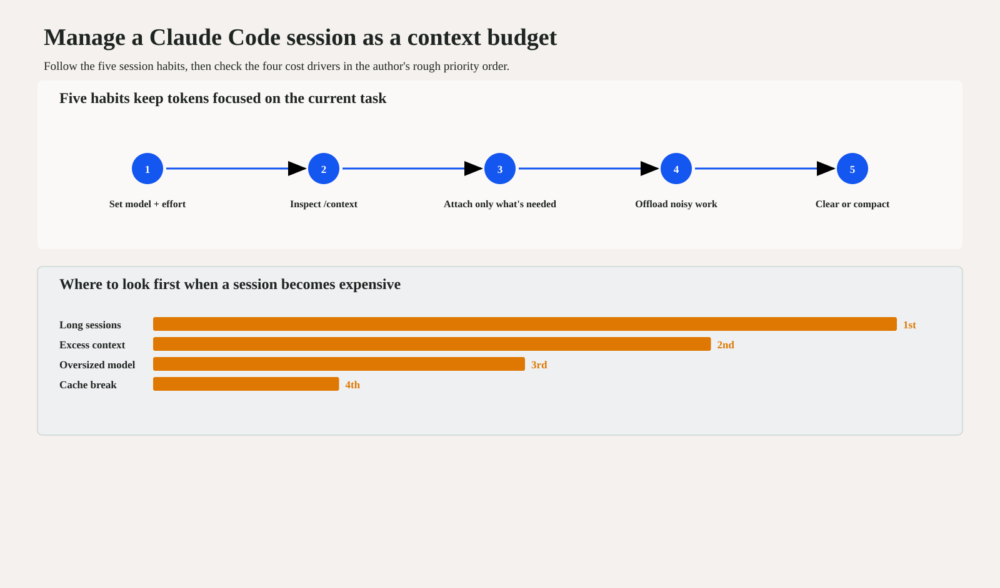

# Maximizing Claude Code Session Value | 3080 Brief

> **Source:** [Maximizing the value of your Claude Code sessions](https://claude.com/blog/maximizing-the-value-of-your-claude-code-sessions), Claude by Anthropic, published August 14, 2026; retrieved August 18, 2026.
>
> The original article remains unchanged. This is a separate, source-grounded decision brief.

## 30-second judgment

> Treat every Claude Code session as a context budget: keep each session short and relevant, set model and effort before starting, and isolate noisy work so tokens serve the current task instead of accumulated history.
>
> Every later turn resends the conversation so far. Cached history is cheaper, but it still consumes context and attention.
>
> When a session becomes expensive, the article's rough priority order is: long sessions, excess context, an oversized model or effort level, then prompt-cache breaks.
>
> Practical routine: inspect startup context, attach only what is needed, quiet or offload noisy output, then clear or compact at a clean boundary.

## One-picture summary

The priority bars show order only, not measured cost magnitude.

## Key questions

| Reader question | Practical answer | Why it matters |
| --- | --- | --- |
| What should I change first? | Use `/clear` between different tasks. | The full conversation is sent again on every later turn, so irrelevant history compounds. |
| Why set model and effort at the start? | Changing model, effort, or fast mode mid-conversation can trigger a full re-prefill. | Those choices affect the prompt-cache key. |
| How do I keep context lean? | Inspect `/context`, `@`-mention needed files once, and suppress or offload noisy command output. | Files and command results remain in the conversation and are reconsidered on later turns. |
| When should I compact, rewind, or use a subagent? | Compact after a completed phase or before a break; rewind recent wrong turns; isolate noisy work. | Each action removes a different kind of context cost. |

## Storyline

### 1. Treat the session as a context budget

Everything added to the conversation is sent again on every later turn. Prompt caching lowers the price of repeated history, but does not remove its context load. Efficiency therefore depends on how much enters the context and how long it remains there.

### 2. Start deliberately

Choose the model, effort level, and fast mode before work begins when possible. Run `/context` in a fresh session and remove unnecessary standing instructions or unused tools.

### 3. Keep additions lean

Attach needed files directly, reduce noisy command output, and use a subagent when log-heavy work is worth isolating. The goal is not to minimize tokens indiscriminately; it is to keep them focused on the requested task.

### 4. Reset at clean boundaries

Use `/clear` between tasks, `/compact` after a completed phase or before a break, and `/rewind` when only recent turns went wrong.

## Evidence boundary

- The source reports cache reads at `0.1x` input price, cache writes at up to `2x`, and output at roughly `5x` input. These are dated Claude Code product economics, not universal benchmark measurements.
- The source labels its curves as illustrative rather than benchmark data.
- The four cost drivers are presented in a rough qualitative order; this brief does not turn that order into a quantitative cost split.
- Product behavior and pricing may change after the source publication date.

[Read the original article →](https://claude.com/blog/maximizing-the-value-of-your-claude-code-sessions)
